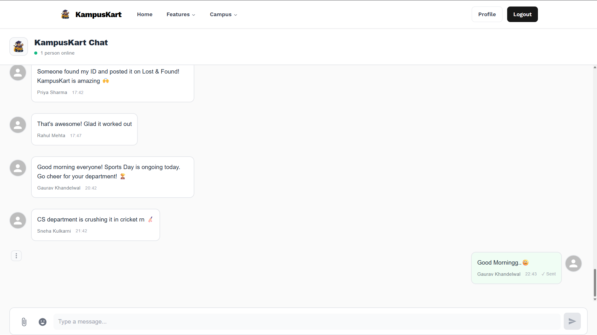
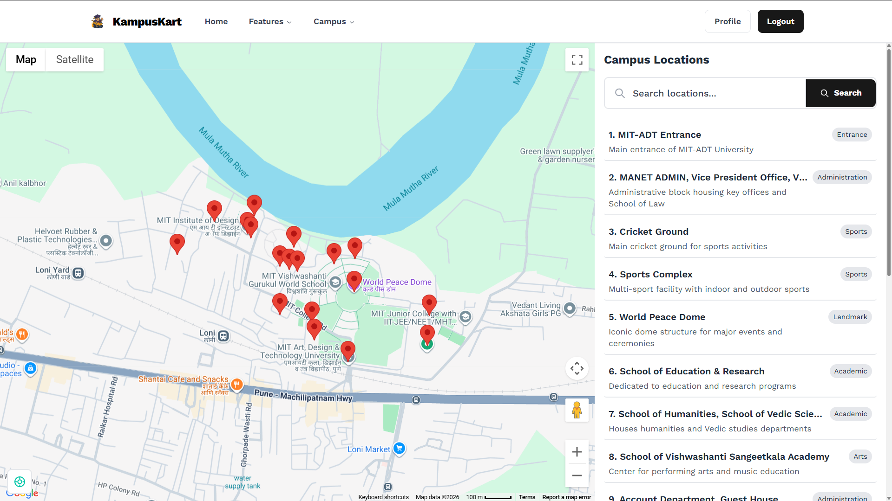
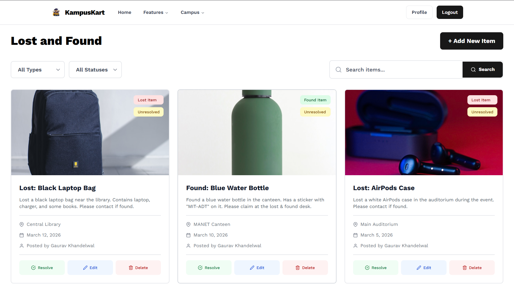

<div align="center">
  

  # KampusKart

  All-in-one campus portal for MIT ADT University

  [](https://kampuskart.netlify.app)
  [](https://github.com/kalviumcommunity/S72_Gaurav_Capstone_KampusKart/actions/)
  [](LICENSE)
  [](https://nodejs.org)

</div>

---

## Overview

KampusKart is a full-stack campus management portal built for MIT ADT University. Students and faculty can navigate the campus, stay updated on news and events, report lost items, submit complaints, chat in real time, and browse club recruitments — all in one place.

---

## Features

| Module | Description |
|--------|-------------|
| Campus Map | Google Maps integration with facility markers and location search |
| News | Rich media news posts with admin management |
| Events | Event listings with registration links, dates, and location details |
| Lost & Found | Report and search lost/found items with image uploads; auto-expires after 14 days |
| Complaints | Submit complaints with category, priority, and department; track status history |
| Facilities | Directory with type, hours, contact info, and images |
| Clubs Recruitment | Listings with deadlines, application form links, and contact info |
| Global Chat | Real-time messaging with emoji reactions, replies, read receipts, and file attachments |
| Authentication | Email/password + Google OAuth, JWT sessions, OTP-based password reset |
| User Profiles | Profile picture, major, year of study, program, gender, date of birth |

---

## Tech Stack

| Layer | Technologies |
|-------|-------------|
| Frontend | React 18, TypeScript, Vite, Tailwind CSS, Material UI, Framer Motion, Socket.IO Client |
| Backend | Node.js, Express 5, MongoDB, Mongoose, JWT, Passport.js, Socket.IO, Cloudinary, Nodemailer |
| Infrastructure | Netlify (frontend), Render (backend), MongoDB Atlas, GitHub Actions |

---

## Screenshots

| Campus Map | Global Chat | Lost & Found |
|:---:|:---:|:---:|
|  |  |  |

---

## Local Setup

### Prerequisites

- Node.js >= 16
- MongoDB (local or [Atlas](https://www.mongodb.com/cloud/atlas))
- Cloudinary account
- Google Cloud project with OAuth 2.0 credentials
- Gmail account (for email/OTP features)

### 1. Clone and install

```bash
git clone https://github.com/kalviumcommunity/S72_Gaurav_Capstone_KampusKart.git
cd S72_Gaurav_Capstone_KampusKart

cd frontend && npm install
cd ../backend && npm install
```

### 2. Configure environment variables

**Backend** — copy and fill in `backend/.env`:

```bash
cp backend/.env.example backend/.env
```

```env
PORT=5000
NODE_ENV=development
MONGODB_URI=mongodb://localhost:27017/kampuskart
JWT_SECRET=your_jwt_secret_minimum_32_characters

CLOUDINARY_CLOUD_NAME=your_cloud_name
CLOUDINARY_API_KEY=your_api_key
CLOUDINARY_API_SECRET=your_api_secret

GOOGLE_CLIENT_ID=your_google_client_id
GOOGLE_CLIENT_SECRET=your_google_client_secret

EMAIL_SERVICE=gmail
EMAIL_USER=your_email@gmail.com
EMAIL_PASS=your_gmail_app_password

FRONTEND_URL=http://localhost:5173
BACKEND_URL=http://localhost:5000
ADMIN_EMAILS=admin@example.com

# Optional: comma-separated list of additional allowed CORS origins
ALLOWED_ORIGINS=https://your-frontend.netlify.app
```

**Frontend** — copy and fill in `frontend/.env`:

```bash
cp frontend/.env.development frontend/.env
```

```env
VITE_API_URL=http://localhost:5000
VITE_SOCKET_URL=http://localhost:5000
VITE_GOOGLE_MAPS_API_KEY=your_google_maps_api_key
VITE_CLOUDINARY_CLOUD_NAME=your_cloud_name
VITE_CLOUDINARY_UPLOAD_PRESET=KampusKart
```

### 3. Run

```bash
# Terminal 1 — backend
cd backend && npm run dev

# Terminal 2 — frontend
cd frontend && npm run dev
```

Frontend runs at `http://localhost:5173`, API at `http://localhost:5000`.

---

## Project Structure

```
KampusKart/
├── frontend/                   # React + TypeScript (Vite)
│   ├── public/                 # Static assets and images
│   └── src/
│       ├── components/         # Feature and UI components
│       │   ├── Chat/           # Real-time chat window
│       │   ├── common/         # Shared UI components
│       │   └── ui/             # Shadcn/Radix UI primitives
│       ├── contexts/           # Auth context (JWT + Google OAuth)
│       ├── hooks/              # Custom React hooks
│       └── utils/              # Helper utilities
├── backend/                    # Node.js + Express
│   ├── config/                 # Passport.js, Cloudinary setup
│   ├── cron/                   # Scheduled jobs (cleanup, keep-alive)
│   ├── middleware/             # Auth (JWT), input validation
│   ├── models/                 # Mongoose schemas
│   ├── routes/                 # REST API route handlers
│   ├── scripts/                # Seed data, uptime monitoring
│   ├── tests/                  # Jest test suites
│   └── utils/                  # Email utilities
└── .github/
    └── workflows/              # CI, CD, keep-alive pipelines
```

---

## API Routes

| Prefix | Routes |
|--------|--------|
| `/api/auth` | `POST /signup`, `POST /login`, `GET /google`, `GET /google/callback`, `POST /forgot-password`, `POST /reset-password`, `POST /refresh` |
| `/api/user` | `GET /profile`, `PUT /profile` |
| `/api/profile` | `GET /`, `PUT /` (with profile picture upload) |
| `/api/lostfound` | CRUD + resolve, admin restore/permanent-delete/cleanup |
| `/api/complaints` | CRUD + status history, admin restore/permanent-delete/cleanup |
| `/api/news` | `GET /` (public), admin `POST`, `PUT /:id`, `DELETE /:id` |
| `/api/events` | `GET /` (public), admin `POST`, `PUT /:id`, `DELETE /:id` |
| `/api/facilities` | `GET /` (public), admin `POST`, `PUT /:id`, `DELETE /:id` |
| `/api/clubs` | `GET /` (public), admin `POST`, `PUT /:id`, `DELETE /:id` |
| `/api/chat` | `GET /messages`, `POST /messages`, edit, delete, reactions, read receipts, search |
| `/api/health` | Server health and readiness status |

---

## CI/CD

| Workflow | Trigger | What it does |
|----------|---------|--------------|
| `ci.yml` | Push / PR to `main`, `develop` | Lint, build, test, security audit |
| `cd.yml` | Push to `main` | Deploy frontend to Netlify, trigger Render deploy |
| `keep-alive.yml` | Every 14 minutes | Ping backend to prevent Render cold starts |

### Required GitHub Secrets

| Secret | Description |
|--------|-------------|
| `VITE_GOOGLE_MAPS_API_KEY` | Google Maps API key for frontend build |
| `NETLIFY_AUTH_TOKEN` | Netlify personal access token |
| `NETLIFY_SITE_ID` | Netlify site ID |
| `RENDER_API_KEY` | Render API key |
| `RENDER_SERVICE_ID` | Render backend service ID |
| `BACKEND_URL` | Full backend URL for keep-alive ping |

---

## Google OAuth Setup

1. Create a project in [Google Cloud Console](https://console.cloud.google.com)
2. Enable the **Google+ API**
3. Create **OAuth 2.0 credentials** (Web application type)
4. Add authorized redirect URIs:
   - Development: `http://localhost:5000/api/auth/google/callback`
   - Production: `https://your-backend.onrender.com/api/auth/google/callback`
5. Set `GOOGLE_CLIENT_ID`, `GOOGLE_CLIENT_SECRET`, and `BACKEND_URL` in `backend/.env`

---

## Admin Access

Admin privileges are granted by email. Add admin email addresses to `ADMIN_EMAILS` in `backend/.env` (comma-separated). Admins can:

- Create, edit, and delete News, Events, Facilities, and Club Recruitments
- View and manage all Complaints and Lost & Found items (including soft-deleted)
- Permanently delete or restore soft-deleted records
- Trigger manual cleanup of expired items

---

## Running Tests

```bash
cd backend && npm test
```

Tests cover auth middleware, input validation, User and Complaint models, route handlers, and email utilities.

---

## Contributing

See [CONTRIBUTING.md](CONTRIBUTING.md) for guidelines. For questions or ideas, use [GitHub Discussions](https://github.com/kalviumcommunity/S72_Gaurav_Capstone_KampusKart/discussions).

---

## License

MIT — see [LICENSE](LICENSE)

---

<div align="center">
  Made by <a href="https://github.com/Gaurav-205">Gaurav Khandelwal</a>
</div>
