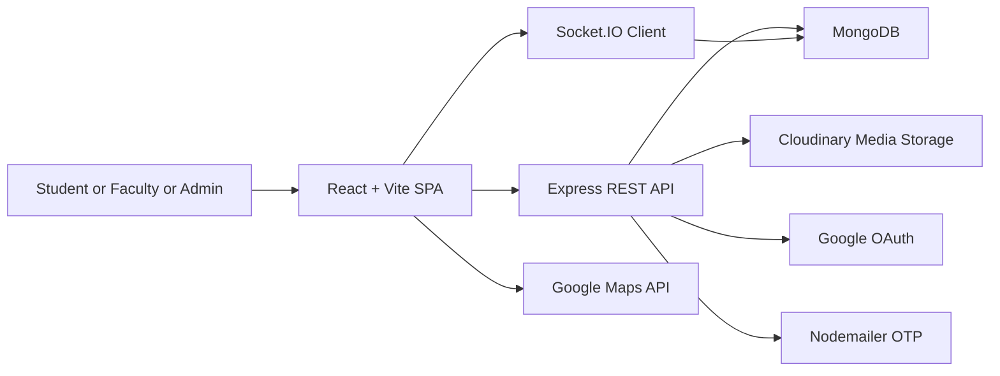

# Architecture

## System overview
KampusKart is a client server application with a React SPA frontend and an Express API backend. MongoDB stores application data, and Cloudinary stores media assets. Socket.IO provides real time chat.

## System diagram

## Key data flows
### Web request flow
1. Browser loads the SPA from Netlify.
2. React app calls REST endpoints on the Express server.
3. Express validates JWTs, runs middleware, and routes requests.
4. Mongoose reads or writes data in MongoDB.
5. Media uploads are streamed to Cloudinary and stored as URLs plus public IDs.

### Real time chat flow
1. Client opens a Socket.IO connection with the JWT in the handshake.
2. Server verifies the token and looks up the user.
3. Client emits join and receives previous messages and online user list.
4. Messages are created via REST and broadcast to the global room.
5. The chat UI uses REST for pagination, edits, deletes, reactions, and read receipts.

## Deployment topology
- Frontend: Netlify build and deploy using Vite
- Backend: Render service running the Express server
- CI and CD: GitHub Actions for linting, testing, builds, and deploy triggers

## Diagram and demo
- Diagram: see `docs/architecture_diagram.mmd` for a compact mermaid diagram.
- Demo: add a 60–90s demo video as `docs/demo.mp4` or link it from `docs/demo.md`.
